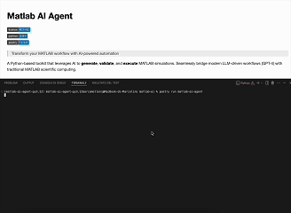

# Matlab AI Agent

[](https://github.com/marcomelloni/matlab-ai-agent/actions)
[](https://codecov.io/gh/marcomelloni/matlab-ai-agent)
[](./LICENSE)
[](https://github.com/marcomelloni/matlab-ai-agent/network/updates)

> Transform your MATLAB workflow with AI-powered automation

A Python-based toolkit that leverages AI to **generate**, **validate**, and **execute** MATLAB simulations. Seamlessly bridge modern LLM-driven workflows (GPT-4) with traditional MATLAB scientific computing.

<div align="center">
   
</div>

## ✨ Features

- 🧠 **AI-Powered Code Generation**  
   Generate clean, production-ready MATLAB scripts with GPT-4 via natural language prompts.
- ✅ **Automatic Code Validation**  
   Catch warnings & errors with MATLAB's `mlint` (`checkcode`) and display line-by-line feedback.
- 🚀 **Real-Time Simulation**  
   Stream and capture simulation outputs, plots, and figures via MATLAB Engine & TCP/IP.
- 🔄 **Error Correction Loop**  
   Auto-fix common syntax & runtime errors by feeding MATLAB error messages back to the LLM.
- 🖥️ **Interactive CLI**  
   Engage in an AI-guided REPL to iteratively refine, validate, and run your MATLAB code.

## 🚀 Quick Setup (In Seconds!)

```bash
# 1. Clone and navigate
git clone https://github.com/marcomelloni/matlab-ai-agent
cd matlab-ai

# 2. Install dependencies with Poetry
poetry install

# 3. Set your OpenAI API key
echo "OPENAI_API_KEY=your_api_key_here" > .env

# 4. Launch and start creating!
poetry run matlab-ai-agent
```

That's it! Start transforming your ideas into working MATLAB code instantly.

## 🔧 Prerequisites

- **Python 3.8+**
- **MATLAB R2024a or later** (with MATLAB Engine for Python installed)
- **OpenAI API Key** (for GPT-4 integration)
- **Poetry** (≥1.5.0) for environment & dependency management

## 📦 Detailed Installation

#### 1. Clone the Repository and Navigate to the Working Directory

```bash
git clone https://github.com/marcomelloni/matlab-ai-agent
cd matlab-ai
```

#### 2. Install Poetry and Create Virtual Environment

Ensure Poetry is installed on your system. If not already installed, execute the following commands:

```bash
python3 -m pip install --user pipx
python3 -m pipx ensurepath
pipx install poetry
```

Verify the installation:

```bash
poetry --version
```

Activate the virtual environment:

```bash
poetry env activate
```

> **Important:**  
> The command `poetry env activate` provides the activation command which must be executed separately.  
> Copy and run the displayed command, for example:

```bash
source /path/to/virtualenv/bin/activate
```

Verify environment activation:

```bash
which python
```

#### 3. Install Project Dependencies

Install all dependencies defined in `pyproject.toml`:

```bash
poetry install
```

#### 4. Install the MATLAB Engine API for Python

To integrate MATLAB with Python, install the MATLAB Engine API within your Poetry environment using one of these methods:

#### 4.1 Installation Using In-built Python Package

Using the package included with your MATLAB installation (example for MATLAB R2024b on MacOS):

```bash
cd /Applications/MATLAB_R2024b.app/extern/engines/python
poetry run python -m pip install .
```

> **Note:** Adjust the path according to your MATLAB version and installation location.

#### 4.2 Install via pip

Alternatively, use the version-specific [matlabengine](https://pypi.org/project/matlabengine) pip package:

```bash
pip install matlabengine==24.2.2
```

Select the version compatible with your MATLAB release from the [package history](https://pypi.org/project/matlabengine/#history).

#### 5. Verify the MATLAB Engine Installation

Confirm successful installation with:

```bash
poetry run python -c "import matlab.engine; print('MATLAB Engine is installed successfully')"
```

Expected output:

```
MATLAB Engine is installed successfully!
```

#### 6. Configure API Key

Create a `.env` file in the project root with your OpenAI API key:

```
OPENAI_API_KEY=your_api_key_here
```

#### 7. Advanced Setup (Optional) 🔧

##### Define Custom Rules and Constraints for Simulations

To enable advanced features of the MATLAB AI Agent, run:

```bash
poetry run matlab-ai-agent --generate-prompt
```

This command creates a `.matlab_ai_prompt` file inside the root directory.

In this file, you can define custom rules and constraints that the agent will follow during code validation and execution.

##### What you can specify in `.matlab_ai_prompt`:

- Required parameters for simulations
- MATLAB functions to avoid (e.g., for performance or security)
- Numeric or logical constraints
- Optimization goals
- Required outputs (e.g., plots, logs, result files)
- Code style or formatting rules
- Any other execution guideline

##### Example content:

```
- Maximum simulation time: 60 seconds
- Avoid using "eval" and "assignin"
- Save key results to "result.mat"
- Save plots as "output.png" if generated
- Prefer vectorized operations
```

> ℹ️ The `.matlab_ai_prompt` file is loaded automatically at runtime.
> To update rules, simply edit the file—no need to rerun the command.

## 🖥️ Usage

### Interactive Mode (Default)

Launch an AI-guided interactive session for generating, validating, and executing MATLAB code:

```bash
poetry run matlab-ai-agent
```

Options:

- `--matlab / --no-matlab`: Enable/disable MATLAB engine for validation and execution (enabled by default)

Interactive capabilities:

- Generate MATLAB code from natural language descriptions
- Validate code with mlint and automatically correct errors
- Execute simulations and diagnose issues
- Refine code through additional prompts
- Save generated code to .m files
- Exit with option to close the MATLAB engine

### Execution Mode

Execute existing MATLAB files:

```bash
poetry run matlab-ai-agent execute path/to/file.m
```

Parameters:

- `<filepath>`: Path to the .m file to execute

The file is executed via the MATLAB engine, with output and simulation results displayed upon successful execution.

## 🛠️ Package Development

The developer-specific commands are:

```bash
# Run test suite
poetry run pytest

# Run linting checks
poetry run pylint src

# Format code automatically
poetry run autopep8 --in-place --aggressive --recursive .
```

## 📄 License

This project is licensed under a modified MIT License.  
**Commercial use is not permitted without explicit permission.**

See the [LICENSE](./LICENSE) file for details.
